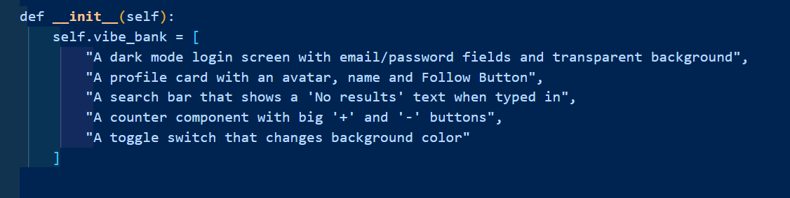
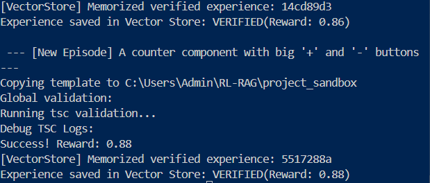

# Bloom RL-RAG: Self-Healing Code Retrieval Layer

This project is a prototype designed to bridge the gap between static Retrieval-Augmented Generation (RAG) and functional code generation for AI-native application builders.

## Why RL-RAG?

* **Feedback Loop (RL):** While human-in-the-loop feedback is common, building an RL reward system based on compilation success allows agents to "practice" building native apps without human supervision.
* **Synthetic Data Strategy:** This solves the "Cold Start" problem where new library versions take time to appear in real-world training sets. The system generates synthetic apps using new libraries to train the agent autonomously.

## Technical Stack

* **Orchestrator:** Python 3.10
* **The Brain:** Ollama (Local LLM Interface)
* **Judge:** Node.js + 'tsc' (TypeScript Compiler)
* **Target Stack:** React Native / Expo
* **Memory:** Custom Jaccard-based Semantic JSON Store (A lightweight Vector DB)

### Self-Healing Life-Cycle

This system operates as a recursive factory, using 4 specialized agents serving different purposes:

* **The Architect:** Transforms a user's need or "vibe" into a JSON blueprint. It estimates complexity and defines the component tree (For example: App -> LoginScreen -> ActionButton).
* **The Builder:** Generates .tsx code using RAG (Retrieval-Augmented Generation) by pulling verified snippets from memory to ensure correct patterns and imports.
* **The Project Manager:** A headless sandbox handler. It symlinks `node_modules` from a 'template' into a `project_sandbox` directory to provide a real-world compilation environment.
* **The Healer:** This acts as the RL-Correction layer. It injects the error logs back into the model with "Strict React-Native-Only" guard-rails to fix AI-hallucinations.

### Reward Logic

A Composite Reward Score ($R$) was implemented to provide a Dense-Reward signal, allowing the model to understand why a snippet is better compared to another. This is calculated as follows:

$$R = \text{Base} - (\text{Complexity} \times 0.02) - (\text{Linter Penalty})$$

#### I) Complexity and Brevity Penalty
* **Logic:** Inspired by metrics such as BLEU, SacreBLEU, and ChrF, this metric prevents "Reward Hacking" where the model will over-engineer code or try to 'fool' in order to pass the test.
* **Impact:** This encourages a more efficient React-Code path. If the Architect plans to build a simple component but the Builder generates complex code, the reward drops.

#### II) Linter and Type Integration (Dense Feedback)
* **Minor Issues (-0.05):** Warnings that doesn't break the app but lower maintainability.
* **Critical Issues (-0.1):** High-severity cases that prevent compilation (e.g., TS2307: Module Not Found).

---

## Instructions

1. **Environment:** Set up your virtual environment using `python -m venv venv` and activate it.
2. **Inference:** Open a separate terminal and run `ollama run llama3` (or preferred coder model).
3. **Dependencies:** Install the following:
    * **Python:** `pip install openai pydantic python-dotenv`
    * **Node.js:** `npm install typescript @types/react @types/react-native @types/node --save-dev`
4. **Template setup (Very important):** Run the following commands:
    ```bash
    mkdir rn_template && cd rn_template
    npm init -y
    npm install react react-native typescript @types/react @types/react-native
    ```
5. **Testing:** Define a Vibe Bank in the `Prober` class to test the Reinforcement Learning loop.
6. **Run:** `python main_loop.py`



## System in Action (Terminal Logs)

```text
[Attempt 1] : Evaluating code...
[Failure]: Reward Score 0.0. 
[Error]: TS2304: Cannot find name 'TouchableOpacity'.

[Attempt 2] : Healing... (Injected Fix)
[Success!!] Code is functional and usable!


```
## Current Benchmarks

Tested using Qwen-2.5-Coder (Local) and TypeScript 5.x:

| Metric | Result |
| :--- | :--- |
| First-Pass Success Rate | 60% (3/5 Challenges) |
| Self-Correction Rate | ~90% (Recovers in < 2 attempts) |
| Average Reward | 0.85 - 0.92 for Verified solutions |

## Roadmap and Next Steps

* **Synthetic Dataset Expansion:** Automating the Prober to generate 1,000+ app scenarios for pre-training the Agentic RAG layer.
* **Adding an Open-Source Fine-Tuning Framework:** Adding a fine tune framework to the pipeline to speedup Fine-Tuning and Training.