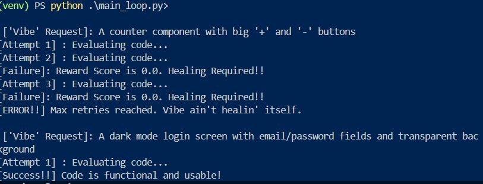

## Bloom RL-RAG: Self-Healing Code Retrieval Layer

-- This project is a prototype designed to bridge the gap between static Retrieval-Augmented Generation (RAG) and functional code generation for AI-native application builders.
Technical Stack

* Orchestrator: Python 3.10
* The Brain: Ollama (Local LLM Interface)
* Judge: Node.js + 'tsc' (TypeScript Compiler)
* Target Stack: React Native / Expo

### Instructions

   1. Environment: Set up your virtual environment using python -m venv venv and activate it.
   2. Inference: Open a separate terminal and run ollama run llama3 (or preferred coder model).
   3. Dependencies: Install the following:
   * Python: pip install openai pydantic python-dotenv
      * Node.js: npm install typescript @types/react @types/react-native @types/node --save-dev
   4. Testing: Define a Vibe Bank in the Prober class to test the Reinforcement Learning loop:
   
  
   
## Output: System in Action (Terminal Logs)
Challenge: "A profile card with an avatar, name and Follow Button"

[Attempt 1] : Evaluating code...
[Failure]: Reward Score 0.0. 
[Error]: TS2304: Cannot find name 'TouchableOpacity'.

[Attempt 2] : Healing... (Injected Fix)
[Success!!] Code is functional and usable!

Why RL-RAG?

* Feedback Loop (RL): While human-in-the-loop feedback is common, building an RL reward system based on compilation success allows agents to "practice" building native apps without human supervision.
* Synthetic Data Strategy: This solves the "Cold Start" problem where new library versions take time to appear in real-world training sets. The system generates synthetic apps using new libraries to train the agent autonomously.

## _How the Self-Healing Loop Works_ ???
The system operates as a three-stage factory:

   1. The Architect (Agentic RAG): The user provides a "vibe" or feature request. The agent pulls relevant patterns from the vector store and documentation.
   2. Quality Control: Before the code is displayed, it is sent to a sandbox where the TypeScript compiler acts as a linter/validator.
   3. Learning (RL Reward System):
   * Success: The code is tagged as "Verified."
      * Failure: The error log is sent to a Refiner LLM. The fix is stored as a new synthetic example, while the failing snippet receives a negative reward.
   
## Current Benchmarks
Tested using Qwen-2.5-Coder (Local) and TypeScript 5.x:

* First-Pass Success Rate: 60% (3/5 Challenges)
* Recovery Rate: High success in resolving syntax and import hallucinations.
* Identified Edge Cases: Complex conditional rendering (e.g., Search Bar logic) requires higher-reasoning models or expanded RAG context.

## Roadmap and Next Steps

* Vector Store Integration: Transitioning from local mocks to a live Pinecone/Weaviate index for verified snippets.
* Linter Integration: Adding ESLint for code-style enforcement during the Quality Control stage.
* Synthetic Dataset Expansion: Automating the Prober to generate 1,000+ app scenarios for pre-training the Agentic RAG layer.
