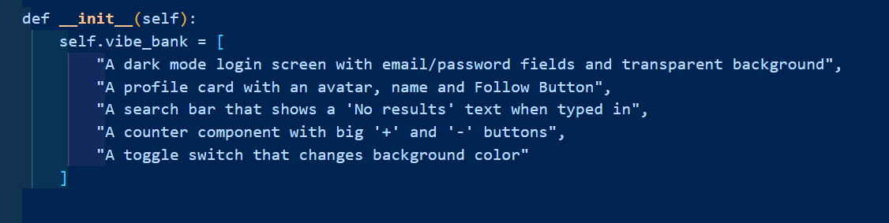
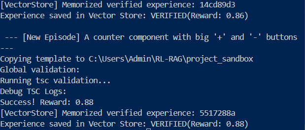

# 🤖 RL-RAG: Self-Healing Code Retrieval Layer

> **AI-powered code generation with reinforcement learning feedback loops** | Bridging **RAG**, **LLMs**, and **React Native** development

This project is a revolutionary prototype designed to bridge the gap between static **Retrieval-Augmented Generation (RAG)** and functional code generation for **AI-native application builders**. Experience autonomous code healing through intelligent reward mechanisms.

## 🎯 Why RL-RAG?

* **Feedback Loop (RL):** While human-in-the-loop feedback is common, building an **RL reward system** based on compilation success allows agents to "practice" building native apps without human supervision. Say goodbye to manual debugging!
* **Synthetic Data Strategy:** This solves the **"Cold Start" problem** where new library versions take time to appear in real-world training sets. The system generates **synthetic apps** using new libraries to train the agent autonomously—perfect for **library version updates** and **rapid prototyping**.

## 🏗️ Technical Stack

* **Orchestrator:** Python 3.10
* **The Brain:** Ollama (Local LLM Interface) | Support for Llama3, Qwen-2.5-Coder, and more
* **Judge:** Node.js + TypeScript Compiler (`tsc`)
* **Target Stack:** **React Native** / **Expo** (iOS & Android)
* **Memory:** Custom **Jaccard-based Semantic JSON Store** (Lightweight Vector DB)

### 🔄 Self-Healing Life-Cycle

This system operates as a **recursive factory**, using **4 specialized agents** serving different purposes:

* **The Architect:** Transforms a user's need or "vibe" into a **JSON blueprint**. It estimates complexity and defines the component tree (For example: App → LoginScreen → ActionButton).
* **The Builder:** Generates `.tsx` code using **RAG (Retrieval-Augmented Generation)** by pulling verified snippets from memory to ensure correct patterns and imports.
* **The Project Manager:** A headless **sandbox handler**. It symlinks `node_modules` from a 'template' into a `project_sandbox` directory to provide a real-world compilation environment.
* **The Healer:** This acts as the **RL-Correction layer**. It injects error logs back into the model with **"Strict React-Native-Only" guard-rails** to fix **AI-hallucinations** and compilation errors.

### 🎁 Reward Logic & Dense Feedback

A **Composite Reward Score** ($R$) was implemented to provide a **Dense-Reward signal**, allowing the model to understand why a snippet is better compared to another. This is calculated as follows:

$$R = \text{Base} - (\text{Complexity} \times 0.02) - (\text{Linter Penalty})$$

#### I) Complexity and Brevity Penalty
* **Logic:** Inspired by metrics such as **BLEU**, **SacreBLEU**, and **ChrF**, this metric prevents **"Reward Hacking"** where the model will over-engineer code or try to 'fool' in order to pass the test.
* **Impact:** This encourages a more efficient **React code path**. If the Architect plans to build a simple component but the Builder generates complex code, the reward drops—promoting elegant, maintainable solutions.

#### II) Linter and Type Integration (Dense Feedback)
* **Minor Issues (-0.05):** Warnings that don't break the app but lower maintainability.
* **Critical Issues (-0.1):** High-severity cases that prevent compilation (e.g., **TS2307: Module Not Found**, **TS2304: Cannot find name**).

---

## 🚀 Instructions

1. **Environment:** Set up your virtual environment using `python -m venv venv` and activate it.
2. **Inference:** Open a separate terminal and run `ollama run llama3` (or preferred coder model).
3. **Dependencies:** Install the following:
    * **Python:** `pip install openai pydantic python-dotenv`
    * **Node.js:** `npm install typescript @types/react @types/react-native @types/node --save-dev`
4. **Template setup (Very important):** Run the following commands:
    ```bash
    mkdir rn_template && cd rn_template
    npm init -y
    npm install react react-native typescript @types/react @types/react-native
    ```
5. **Testing:** Define a Vibe Bank in the `Prober` class to test the **Reinforcement Learning** loop.
6. **Run:** `python main_loop.py`



## ⚙️ System in Action (Terminal Logs)

```text
[Attempt 1] : Evaluating code...
[Failure]: Reward Score 0.0. 
[Error]: TS2304: Cannot find name 'TouchableOpacity'.

[Attempt 2] : Healing... (Injected Fix)
[Success!!] Code is functional and usable!
```




## 📝 Recent Updates

* ✅ **Prober Enhanced:** Modified to inject code directly unto generated app components as required.
* ✅ **Main Loop Upgraded:** Now handles **100+ permutations** of components, styles, and constraint prompts for **Synthetic Data Generation**, along with assembly sandbox capabilities.
* ✅ **Branch:** `Synthetic-Data-Expansion` - Focus on autonomous dataset generation for pre-training.

## 📊 Current Benchmarks

Tested using **Qwen-2.5-Coder** (Local) and **TypeScript 5.x**:

| Metric | Result | Insight |
| :--- | :--- | :--- |
| **First-Pass Success Rate** | 60% (3/5 Challenges) | Quality over quantity—pre-trained agent |
| **Self-Correction Rate** | ~90% (Recovers in < 2 attempts) | Efficient error recovery via RL feedback |
| **Average Reward** | 0.85 - 0.92 for Verified solutions | Consistent, production-ready code |

## 🗺️ Roadmap and Next Steps

* **Synthetic Dataset Expansion (In Progress):** Automating the Prober to generate **1,000+ app scenarios** for pre-training the **Agentic RAG layer**.
* **Hybrid Assembly Engine:** Adding a **High-Speed Data Gen framework** optimized for **low-GPU environments** to achieve **zero import errors**.
* **Multi-Model Support:** Expanding beyond Llama3 to include GPT-4, Claude, and Gemini integrations.
* **Production Deployment:** Container support (Docker) and cloud-native CI/CD pipelines.

---

## 🔑 Key Technologies & Keywords

**AI/ML:** Reinforcement Learning (RL) | Retrieval-Augmented Generation (RAG) | Large Language Models (LLMs) | Agentic AI

**Development:** React Native | Expo | TypeScript | Node.js | Python 3.10

**Data:** Synthetic Data Generation | Cold Start Problem | Vector Database | Semantic Search

**DevOps:** Sandbox Environment | Compilation Success | Self-Healing | Code Correction

---

**Built for the AI-native future. Contribute, experiment, and help shape autonomous code generation.** 🚀